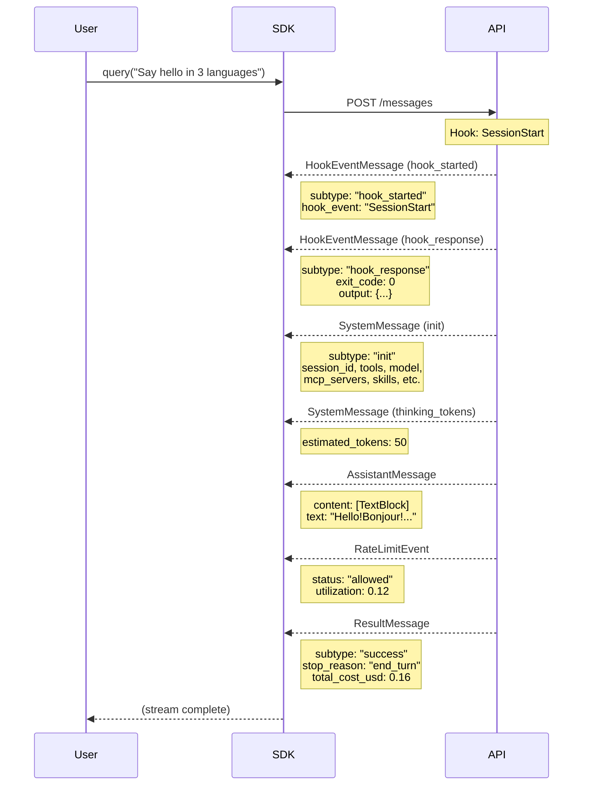
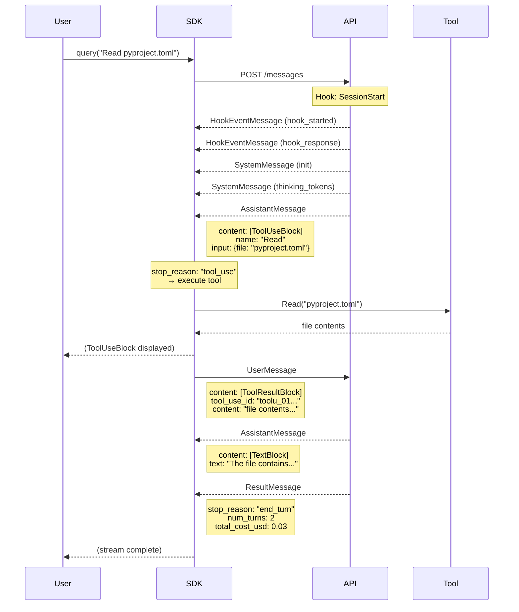
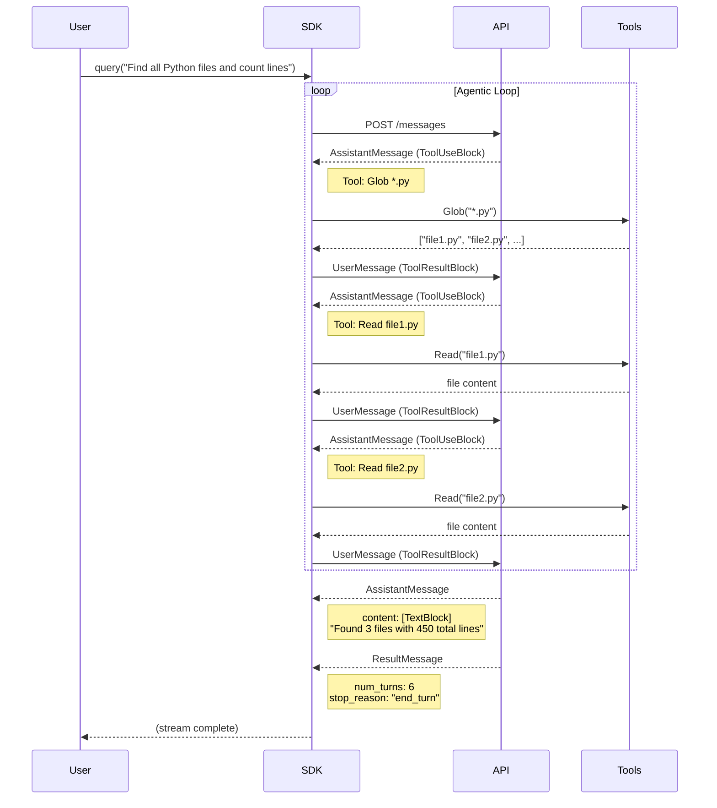
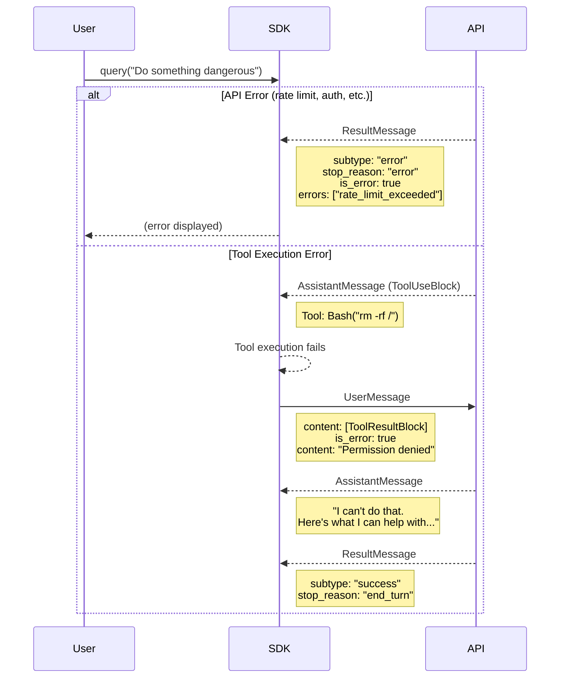
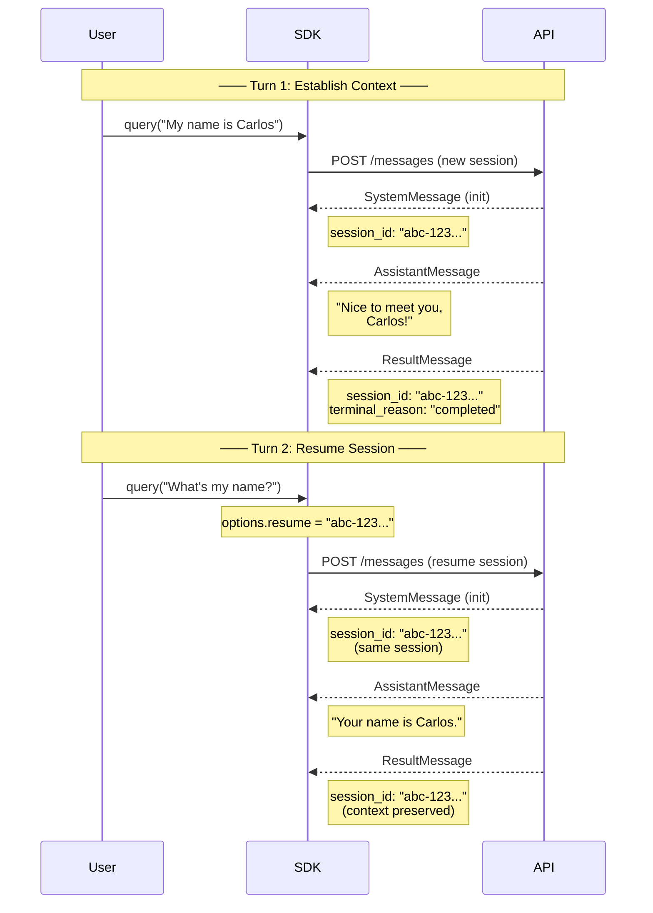
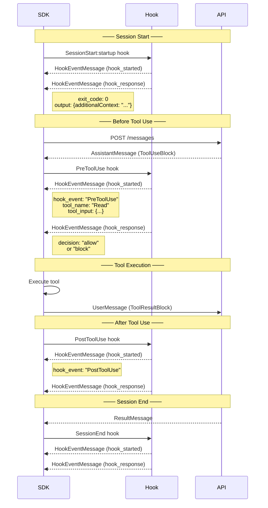
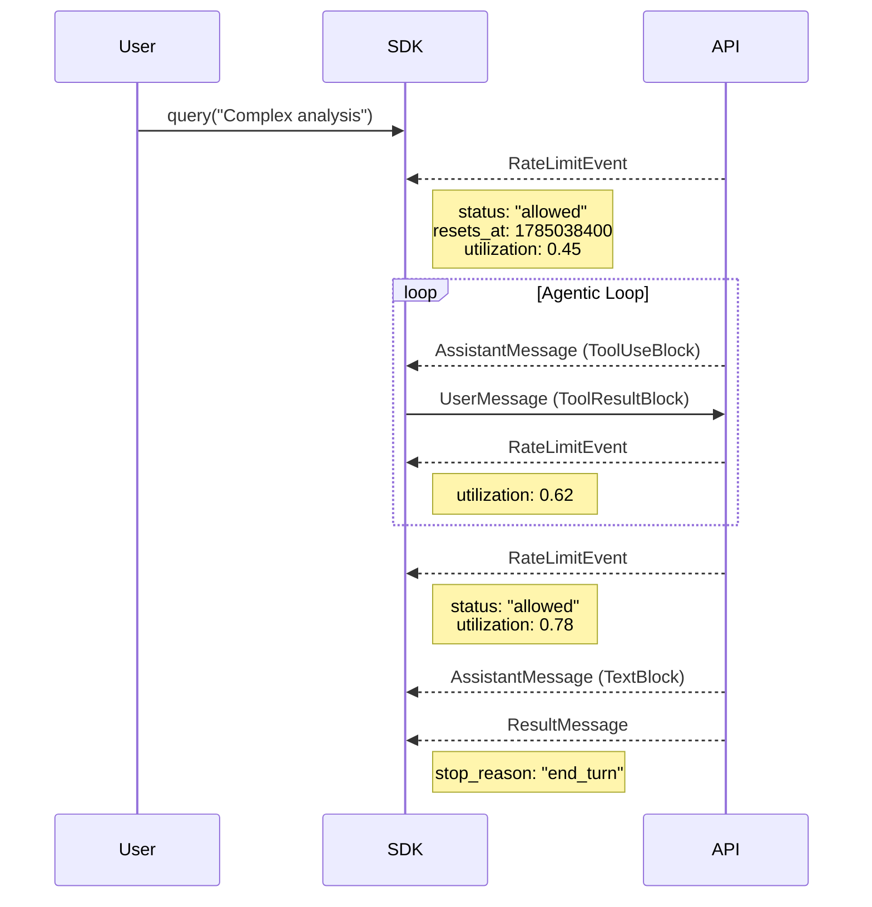
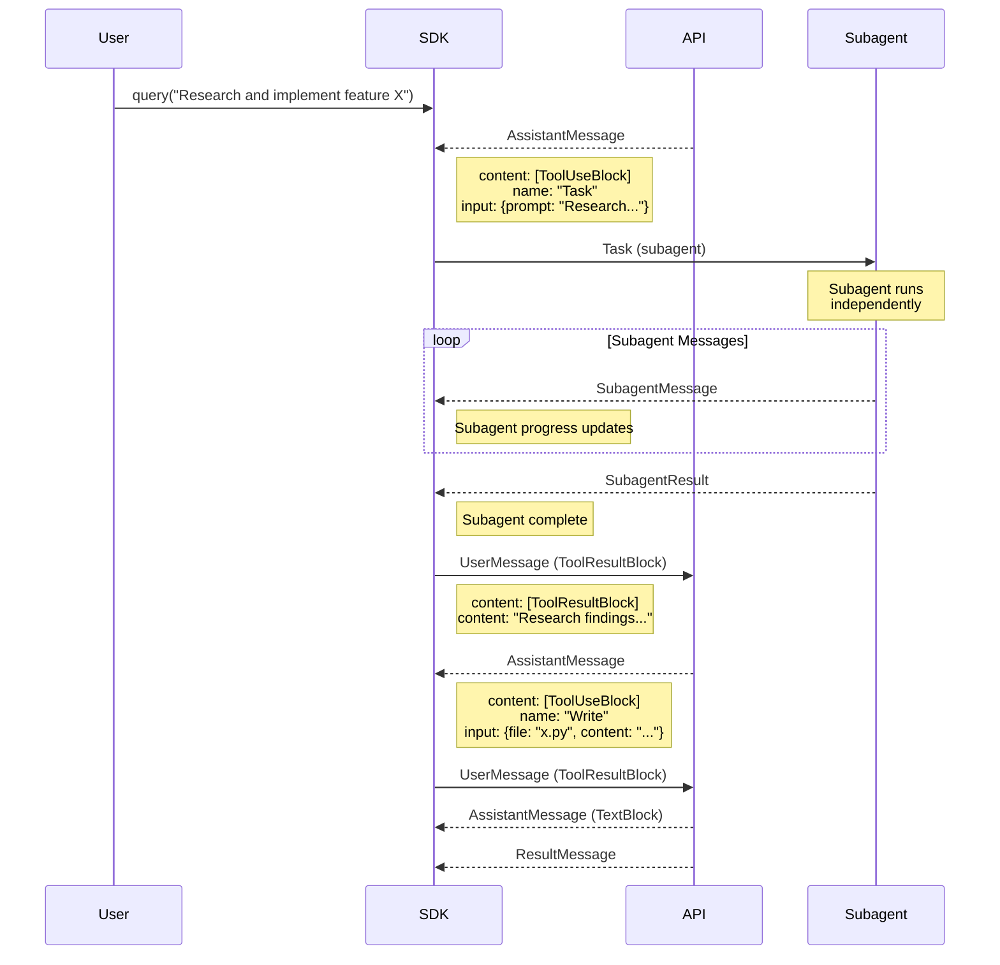
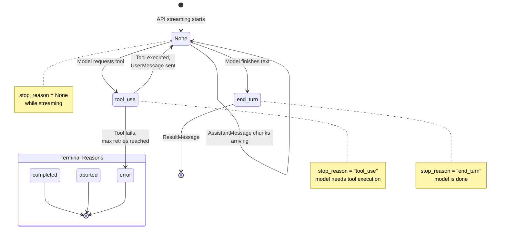

# Claude Agent SDK — Message Flows

Complete reference for every message type, flow pattern, and state transition in the Claude Agent SDK. Each section includes a Mermaid diagram showing the exact sequence of messages.

---

## Table of Contents

1. [Message Types](#message-types)
2. [Flow 1: Simple Query (No Tools)](#flow-1-simple-query-no-tools)
3. [Flow 2: Tool Use (Single Turn)](#flow-2-tool-use-single-turn)
4. [Flow 3: Multi-Turn Tool Loop](#flow-3-multi-turn-tool-loop)
5. [Flow 4: Error Handling](#flow-4-error-handling)
6. [Flow 5: Session Resume (Memory)](#flow-5-session-resume-memory)
7. [Flow 6: Hooks Lifecycle](#flow-6-hooks-lifecycle)
8. [Flow 7: Rate Limiting](#flow-7-rate-limiting)
9. [Flow 8: Streaming with Subagents](#flow-8-streaming-with-subagents)
10. [State Diagram: stop_reason Transitions](#state-diagram-stop_reason-transitions)
11. [Complete Message Reference](#complete-message-reference)

---

## Message Types

Every message yielded by `query()` or `query_stream()` is one of these types:

```
┌─────────────────────────────────────────────────────────────────────┐
│                        SDK Message Types                           │
├─────────────────────┬───────────────────────────────────────────────┤
│ HookEventMessage    │ Hook lifecycle (started / response)           │
│ SystemMessage       │ Session init, thinking tokens, status         │
│ AssistantMessage    │ Model output (text, tool_use, thinking)       │
│ UserMessage         │ Tool results returned to model                │
│ RateLimitEvent      │ Rate limit status updates                     │
│ ResultMessage       │ Final message — contains cost, session_id     │
└─────────────────────┴───────────────────────────────────────────────┘
```

### Message Fields

#### HookEventMessage

| Field | Type | Description |
|-------|------|-------------|
| `subtype` | `"hook_started"` \| `"hook_response"` | Hook lifecycle phase |
| `data` | `dict` | Full hook payload (hook_id, hook_name, hook_event, output, stdout, stderr, exit_code, outcome) |
| `hook_event_name` | `str` | Event type: `SessionStart`, `PreToolUse`, `PostToolUse`, etc. |
| `session_id` | `str` | Session this hook belongs to |
| `uuid` | `str` | Unique message ID |

#### SystemMessage

| Field | Type | Description |
|-------|------|-------------|
| `subtype` | `"init"` \| `"thinking_tokens"` \| ... | System event type |
| `data` | `dict` | Event payload — for `init`: cwd, session_id, tools, model, etc. |
| `session_id` | `str` | Session ID (in data dict) |

#### AssistantMessage

| Field | Type | Description |
|-------|------|-------------|
| `content` | `list[Block]` | `TextBlock`, `ToolUseBlock`, or `ThinkingBlock` |
| `model` | `str` | Model used (e.g., `"claude-sonnet-5"`) |
| `stop_reason` | `None` \| `"end_turn"` \| `"tool_use"` | `None` while streaming, final value at end |
| `usage` | `dict` | Token counts (input, output, cache) |
| `message_id` | `str` | API message ID |
| `session_id` | `str` | Session this message belongs to |
| `uuid` | `str` | Unique message ID |

#### UserMessage

| Field | Type | Description |
|-------|------|-------------|
| `content` | `list[ToolResultBlock]` | Tool execution results |
| `uuid` | `str` | Unique message ID |
| `parent_tool_use_id` | `str` \| `None` | Links to the AssistantMessage tool call |
| `tool_use_result` | `dict` | Tool execution metadata (stdout, stderr, exit_code, etc.) |

#### RateLimitEvent

| Field | Type | Description |
|-------|------|-------------|
| `rate_limit_info` | `RateLimitInfo` | Status, utilization, resets_at, overage_status |
| `uuid` | `str` | Unique message ID |
| `session_id` | `str` | Session ID |

#### ResultMessage

| Field | Type | Description |
|-------|------|-------------|
| `subtype` | `"success"` \| `"error"` | Final outcome |
| `stop_reason` | `"end_turn"` \| `"max_turns"` \| `"max_tokens"` \| `"error"` | Why the agent stopped |
| `terminal_reason` | `"completed"` \| `"aborted"` \| ... | Terminal state reason |
| `num_turns` | `int` | Number of agentic loop iterations |
| `total_cost_usd` | `float` | Total API cost |
| `session_id` | `str` | Session ID (use for resume) |
| `duration_ms` | `int` | Wall clock time |
| `duration_api_ms` | `int` | API time only |
| `usage` | `dict` | Aggregated token usage |
| `result` | `str` | Final text output |
| `errors` | `list` \| `None` | Any errors encountered |

---

## Flow 1: Simple Query (No Tools)

The most basic flow — user sends a prompt, model responds with text.



**Key characteristics:**
- Single `AssistantMessage` with only `TextBlock`
- `stop_reason` goes from `None` (streaming) to `"end_turn"` (final)
- No `ToolUseBlock` — model didn't request any tools

---

## Flow 2: Tool Use (Single Turn)

Model requests a tool, SDK executes it, model processes the result.



**Key characteristics:**
- `AssistantMessage` contains `ToolUseBlock` (not `TextBlock`)
- SDK sends `UserMessage` with `ToolResultBlock` back to API
- Second `AssistantMessage` contains the final text response
- `num_turns: 2` in `ResultMessage` (one tool use = two turns)

---

## Flow 3: Multi-Turn Tool Loop

Model uses multiple tools in sequence before responding.



**Key characteristics:**
- Loop continues until model returns `TextBlock` (stop_reason: `"end_turn"`)
- Each tool call adds 2 to `num_turns`
- `max_turns` option can break the loop early

---

## Flow 4: Error Handling

Multiple error scenarios and how the SDK handles them.



### Error Fields

| Field | Location | Description |
|-------|----------|-------------|
| `is_error` | `ResultMessage` | `true` if the run failed |
| `errors` | `ResultMessage` | List of error strings |
| `api_error_status` | `ResultMessage` | API-level error info |
| `is_error` | `ToolResultBlock` | `true` if tool execution failed |

---

## Flow 5: Session Resume (Memory)

Using `session_id` to maintain context across separate API calls.



**Key points:**
- `session_id` appears in `SystemMessage(init)` and `ResultMessage`
- Pass `session_id` via `ClaudeAgentOptions(resume=session_id)`
- Without resume, each `query()` is a fresh session (no memory)

---

## Flow 6: Hooks Lifecycle

Hooks fire at specific points in the agent lifecycle.



### Hook Events

| Event | When | Purpose |
|-------|------|---------|
| `SessionStart` | Session begins | Load skills, inject context |
| `PreToolUse` | Before tool execution | Allow/block/modify tool calls |
| `PostToolUse` | After tool execution | Log, modify results |
| `SessionEnd` | Session completes | Cleanup, final logging |

---

## Flow 7: Rate Limiting

Rate limit events and how they affect the flow.



### Rate Limit States

| Status | Meaning |
|--------|---------|
| `"allowed"` | Request permitted, continue |
| `"rejected"` | Rate limited, wait for reset |
| `"overage"` | Using overage credits |

---

## Flow 8: Streaming with Subagents

Subagent dispatch and result collection.



---

## State Diagram: stop_reason Transitions

How `stop_reason` changes throughout a conversation.



---

## Complete Message Reference

### Session Initialization Sequence

```
1. HookEventMessage (hook_started)     ← SessionStart hook begins
2. HookEventMessage (hook_response)    ← SessionStart hook completes
3. SystemMessage (init)                ← Session configured (tools, model, cwd, etc.)
```

### Tool Use Sequence

```
4. SystemMessage (thinking_tokens)     ← Model thinking (optional)
5. AssistantMessage                    ← Model output (ToolUseBlock or TextBlock)
6. [RateLimitEvent]                    ← Rate limit status (optional)
7. [UserMessage]                       ← Tool results (if tool was called)
8. Go to step 4                        ← Loop continues until end_turn
```

### Session Termination Sequence

```
9.  ResultMessage                      ← Final result (cost, session_id, stop_reason)
10. [HookEventMessage]                 ← SessionEnd hook (optional)
```

### Message Type Frequency

| Message Type | Frequency | Notes |
|-------------|-----------|-------|
| `HookEventMessage` | 2-6 per session | Always paired (started + response) |
| `SystemMessage` | 1+ per session | `init` always first, `thinking_tokens` per turn |
| `AssistantMessage` | 1+ per turn | Contains `TextBlock`, `ToolUseBlock`, or `ThinkingBlock` |
| `UserMessage` | 0+ per turn | Only when tools are executed |
| `RateLimitEvent` | 0+ per session | Periodic status updates |
| `ResultMessage` | 1 per session | Always the final message |

---

## Appendix: Block Types in AssistantMessage.content

| Block Type | Fields | When Used |
|-----------|--------|-----------|
| `TextBlock` | `text` | Model generating text response |
| `ToolUseBlock` | `id`, `name`, `input` | Model requesting tool execution |
| `ThinkingBlock` | `thinking`, `signature` | Extended thinking / reasoning |

---

## Appendix: ResultMessage.stop_reason Values

| Value | Meaning |
|-------|---------|
| `"end_turn"` | Model finished naturally |
| `"tool_use"` | Model requested a tool (should not appear in final result) |
| `"max_turns"` | Hit the `max_turns` limit |
| `"max_tokens"` | Hit the `max_tokens` limit |
| `"error"` | An error occurred |

---

## Appendix: ResultMessage.terminal_reason Values

| Value | Meaning |
|-------|---------|
| `"completed"` | Normal completion |
| `"aborted"` | User or system aborted |
| `"error"` | Error termination |
| `"timeout"` | Session timed out |
